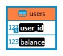

Создана база данных finance с одной таблицей users
user_id
balance

Создан класс по работе с БД DatabaseManager.
В этом классе созданы функции: getBalance, putMoneу, takeMoney и другие.

Настройки подключения к БД (название БД, IP-адрес, логин и пароль)
хранятся в файле application.properties.

Реализован Rest API для getBalance: http://localhost:9090/1/balance,
putMoney: http://localhost:9090/1/deposit?amount=50.0,
и takeMoney: http://localhost:9090/1/withdraw?amount=20.0.

В репозитории есть файл дампа БД finance.sql