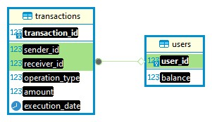

Создана база данных finance с таблицами users и transactions

Создан класс по работе с БД DatabaseManager.
В этом классе созданы функции: getBalance, putMoneу, takeMoney,
transferMoney и другие.

Настройки подключения к БД (название БД, IP-адрес, логин и пароль)
хранятся в файле application.properties.

Реализован Rest API для 
getBalance: http://localhost:9090/1/balance,
putMoney: http://localhost:9090/1/deposit?amount=50.0,
takeMoney: http://localhost:9090/1/withdraw?amount=20.0,
transferMoney: http://localhost:9090/1/transfer?recipientId=2&amount=15

В репозитории есть файл дампа БД finance.sql

Тесты в процессе разработки